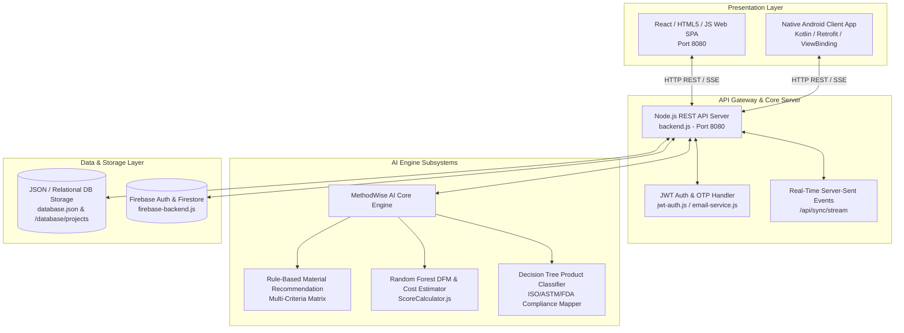

# MethodWise AI — AI-Powered Manufacturing Process & Cost Engineering Platform

> **Analyze. Optimize. Manufacture.** A complete, production-grade AI-powered manufacturing engineering ecosystem enabling hardware engineers, product designers, and procurement managers to instantly optimize Design for Manufacturability (DFM) scores, estimate production costs, select optimal industrial materials, and synchronize project data seamlessly across Web SPA and Native Android applications.

[](https://opensource.org/licenses/MIT)
[](https://nodejs.org/)
[](https://developer.mozilla.org/)
[](https://developer.android.com/)
[](https://firebase.google.com/)
[](https://jwt.io/)
[](#-ai-engine-core-architecture)

---

## 🏛️ System Architecture & Topology

MethodWise AI connects presentation clients (**Web SPA & Native Android Client**) to a unified asynchronous backend API gateway, high-performance zero-dependency AI engine, and relational/JSON persistence layers.



---

## 💻 Repository Directory Guide

The repository is structured into distinct, self-contained modules:

- 📁 **`AI Engine/`** — Core machine learning models and decision engines:
  - `MaterialRecommendation/` — Multi-criteria expert rule engine (`RuleBasedEngine.js`) & physical property database (`MaterialRules.js`).
  - `ManufacturingScore/` — Random Forest ensemble scoring model (`RandomForestModel.js`) and composite DFM/Cost aggregator (`ScoreCalculator.js`).
  - `ProductClassification/` — Machine learning decision tree classifier (`DecisionTreeModel.js`) mapping regulatory standards (`ProductClassifier.js`).
- 📁 **`backend/` & `backend.js`** — Dedicated Node.js REST API backend server with JWT bearer auth, 6-digit email OTP verification, and real-time SSE event broadcasting.
- 📁 **`android/`** — Native Android Studio mobile application built with Kotlin/Java, featuring Retrofit HTTP REST client, ViewBinding, and live synchronization.
- 📁 **`database/`** — Normalized relational database definitions, project data storage (`database.json`), and seed records.
- 📁 **`firebase/`** — Web and Node.js Firebase integration files (`firebase-frontend.js`, `firebase-backend.js`).
- 📁 **`css/`, `js/`, `index.html`** — Modern web single page application (SPA) featuring interactive DFM scoring, material trade-off matrix, and project dashboard.
- 📁 **`security/`, `performance/`, `load-testing/`** — Security vulnerability analysis tools, static code auditors, and stress testing suites.
- 📁 **`selenium-tests/`, `appium-tests/`** — Automated End-to-End (E2E) testing framework for Web browsers and Android devices.

---

## 🛠️ Features & Capabilities

1. **Intelligent Material Recommendation Engine:**
   - Evaluates multi-criteria input parameters (tensile strength, thermal limits, chemical resistance, cost, load profile).
   - Computes compatibility scores and trade-off matrices across 50+ industrial polymers, metals, and composite materials (ABS, Nylon PA66, Titanium Ti-6Al-4V, PLA, Stainless Steel, etc.).

2. **Random Forest DFM & Cost Estimation Engine:**
   - Pre-trained ensemble scoring algorithm estimating Design for Manufacturability (DFM) percentage (0-100%) and unit cost breakdown (INR / USD).
   - Dynamic batch-size scaling (1 to 100,000+ units) across multiple manufacturing processes (CNC Machining, Injection Molding, Sheet Metal Fabrication, 3D Printing).

3. **Automated Product Classification & Regulatory Mapper:**
   - Decision tree machine learning classifier assigning ISO, ASTM, DIN, and FDA compliance standards, tolerance classes, and domain categories.

4. **Real-Time Cross-Platform SSE Synchronization:**
   - Bi-directional live data stream using Server-Sent Events (`/api/sync/stream`) to sync project state instantly between Web SPA and Native Android apps.

5. **Dual Authentication & Enterprise Security:**
   - JWT Bearer Token authorization paired with Firebase Authentication.
   - 6-digit Email OTP password reset mechanism via Nodemailer integration.

6. **Comprehensive Automated Testing & QA:**
   - Full test automation with Selenium Webdriver for Web SPA and Appium for native Android APK verification.

---

## 🚀 Quick-Start Ecosystem Run Guide

To run the entire ecosystem locally on your developer workstation, launch components in sequence:

### Step 1: Initialize Database & Environment

Ensure Node.js (v18.x or v20.x) is installed. Initialize project dependencies:

```bash
npm install
```

### Step 2: Start the Unified Backend API Server

Launch the backend REST API server on port 8080:

```bash
# Start backend server
node backend.js

# Or using npm command
npm run dev
```

*Interactive Server Log Output:*
```
======================================================
  MethodWise AI Backend Server Running
  Local URL:   http://localhost:8080
  Network URL: http://<YOUR_WIFI_IP>:8080
  API Docs:    http://localhost:8080/docs
======================================================
```

### Step 3: Run the Web Application

Open a browser and navigate to:
```
http://localhost:8080/index.html
```
Or launch automatically via npm script:
```bash
npm run web
```

### Step 4: Run the Android Client App

1. Open the `/android` folder in **Android Studio**.
2. Configure your workstation IP in `android/app/src/main/assets/js/firebase-config.js` or `local.properties`.
3. Build and launch on an emulator or connected device:

```powershell
cd android
.\gradlew.bat assembleDebug
```
*Compiled APK location:* `MethodWise_AI.apk` or `android/app/build/outputs/apk/debug/app-debug.apk`

---

## 🧪 Testing & Quality Assurance

Run the automated test suites to verify system stability across platforms:

```bash
# Run Web E2E Selenium Tests
npm run test:web

# Run Mobile E2E Appium Tests
npm run test:mobile

# Run Load & Performance Tests
npm run test:performance
```

---

## 🔒 Security & Compliance

- **JWT Token Validation**: Enforces signed JWT header validation across all `/api/projects` endpoints.
- **Data Protection**: Input sanitization, CORS header protection, and secure password hashing.
- **Audit Reports**: Includes automated vulnerability test results in `Vulnerability Test Results/`.

---

## 📄 License

This project is licensed under the [MIT License](LICENSE).
